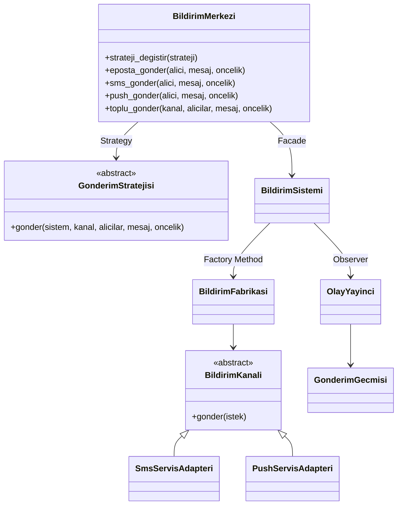

# A - Bildirim Sistemi

Bu projede **A - Bildirim Sistemi** konusu secildi. Baslangic kodunda e-posta, SMS ve push bildirimleri tek bir sinif icinde `if-elif` zincirleriyle yonetilir. Bu konu, tasarim oruntulerinin neden gerekli oldugunu gostermek icin uygundur; cunku yeni bir bildirim turu veya gonderim kurali eklemek baslangicta mevcut kodu degistirmeyi zorunlu kilar.

**Ogrenci:** 221229031 Ayşegül Doğan  
**Ders:** Yazilim Tasarim Oruntuleri  
**Ogretim Uyesi:** Dr. Öğr. Üyesi Burak YILMAZ

## Proje Durumu

Bu repo, bildirim sisteminin bilincli olarak sorunlu bir baslangic kodundan daha genisletilebilir bir mimariye evrilmesini gosterir. Sistem e-posta, SMS ve push bildirimi gonderebilir; dis servisleri uyarlayabilir; gonderim olaylarini dinleyicilere yayinlayabilir; gonderim davranisini strateji ile degistirebilir.

## Calistirma

```bash
python3 -m venv .venv
source .venv/bin/activate
pip install -e . -r requirements-dev.txt
python -m bildirim.demo
```

Sistemde `python3-venv` yoksa test icin su komut da kullanilabilir:

```bash
python3 -m pip install --user -e . -r requirements-dev.txt
python3 -m pytest -q
```

## Test

```bash
pytest -q
```

GitHub Actions, her push ve pull request icin ayni testleri calistirir.

## Fazlar

- Faz 0: Baslangic kodu ve tasarim sorunlari analizi.
- Faz 1: Factory Method ile nesne olusturma sorumlulugunun ayrilmasi.
- Faz 2: Adapter ve Facade ile dis servis uyumu ve kullanim kolayligi.
- Faz 3: Observer ve Strategy ile genisletilebilir davranis yapisi.

## Su Ana Kadar Kullanilan Oruntuler

- **Factory Method:** Bildirim kanali nesnesi olusturma sorumlulugu `BildirimFabrikasi` sinifina tasindi.
- **Adapter:** SMS ve push icin ornek dis servisler ortak bildirim arayuzune uyarlandi.
- **Facade:** `BildirimMerkezi`, sistemin ana kullanim noktasi olarak eklendi.
- **Observer:** Gonderim tamamlandiginda olay yayinlanarak gecmis ve diger dinleyiciler bilgilendirildi.
- **Strategy:** Gonderim politikasi `BildirimMerkezi` icinde degistirilebilir hale getirildi.

## Mimari Diyagram



## Acik/Kapali Prensibi

Testlerde yeni bir gonderim stratejisi sadece test dosyasinda tanimlanir ve `BildirimMerkezi` icine verilir. Mevcut `BildirimMerkezi`, `BildirimSistemi` veya kanal siniflari degistirilmeden yeni davranis eklenebilir. Bu durum, sistemin en az bir noktada Acik/Kapali Prensibi'ne uygun hale geldigini gosterir.
