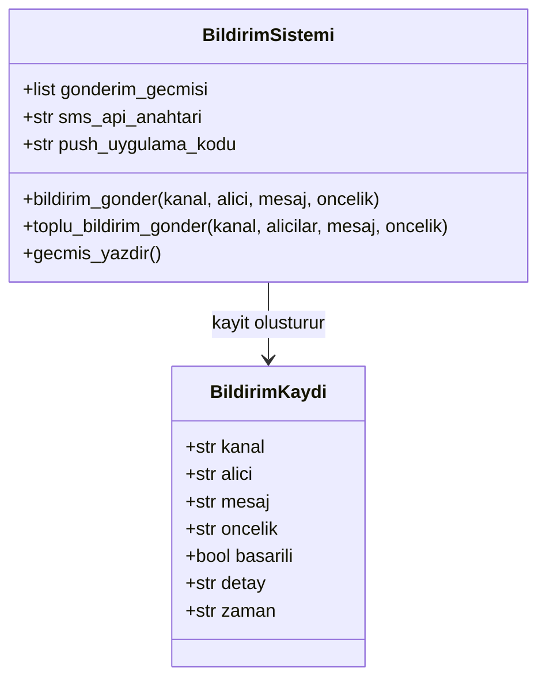

# Faz 0 Baslangic UML

```mermaid
classDiagram
    class BildirimSistemi {
        +list gonderim_gecmisi
        +str sms_api_anahtari
        +str push_uygulama_kodu
        +bildirim_gonder(kanal, alici, mesaj, oncelik)
        +toplu_bildirim_gonder(kanal, alicilar, mesaj, oncelik)
        +gecmis_yazdir()
    }

    class BildirimKaydi {
        +str kanal
        +str alici
        +str mesaj
        +str oncelik
        +bool basarili
        +str detay
        +str zaman
    }

    BildirimSistemi --> BildirimKaydi : kayit olusturur
```

Bu diyagram baslangictaki temel sorunu gosterir: kanal secimi, dogrulama, gonderim ve gecmis tutma tek sinifta toplanmistir.

