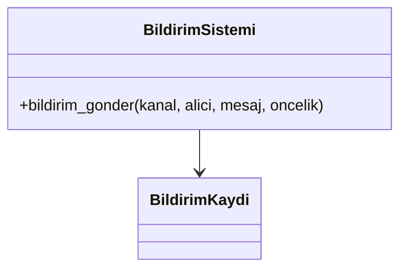
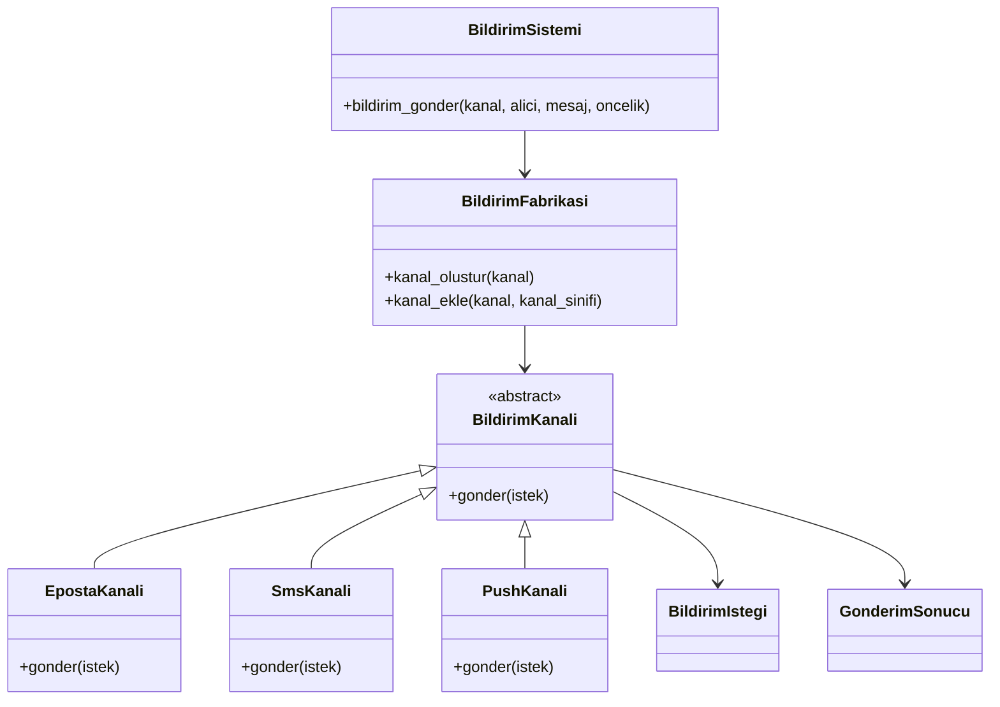

# Faz 1 Factory Method UML

## Once

Baslangicta `BildirimSistemi`, kanal secimini ve kanal davranislarini kendi icinde tutuyordu.

## Sonra

Factory Method ile hangi kanal nesnesinin olusturulacagi `BildirimFabrikasi` sinifina tasindi.

