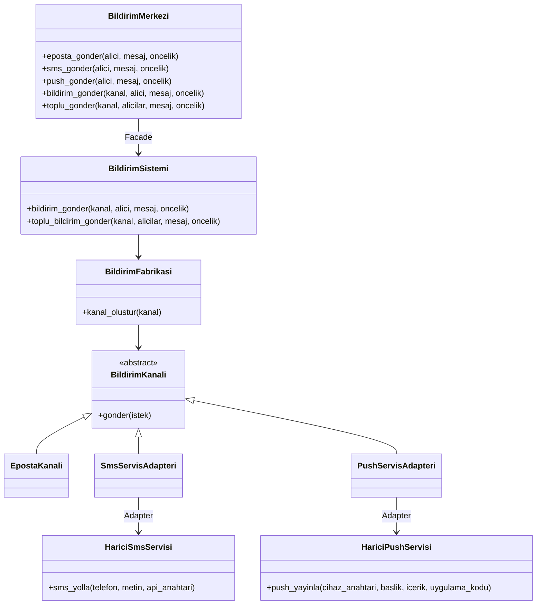

# Faz 2 Structural UML

```mermaid
classDiagram
    class BildirimMerkezi {
        +eposta_gonder(alici, mesaj, oncelik)
        +sms_gonder(alici, mesaj, oncelik)
        +push_gonder(alici, mesaj, oncelik)
        +bildirim_gonder(kanal, alici, mesaj, oncelik)
        +toplu_gonder(kanal, alicilar, mesaj, oncelik)
    }

    class BildirimSistemi {
        +bildirim_gonder(kanal, alici, mesaj, oncelik)
        +toplu_bildirim_gonder(kanal, alicilar, mesaj, oncelik)
    }

    class BildirimFabrikasi {
        +kanal_olustur(kanal)
    }

    class BildirimKanali {
        <<abstract>>
        +gonder(istek)
    }

    class EpostaKanali
    class SmsServisAdapteri
    class PushServisAdapteri
    class HariciSmsServisi {
        +sms_yolla(telefon, metin, api_anahtari)
    }
    class HariciPushServisi {
        +push_yayinla(cihaz_anahtari, baslik, icerik, uygulama_kodu)
    }

    BildirimMerkezi --> BildirimSistemi : Facade
    BildirimSistemi --> BildirimFabrikasi
    BildirimFabrikasi --> BildirimKanali
    BildirimKanali <|-- EpostaKanali
    BildirimKanali <|-- SmsServisAdapteri
    BildirimKanali <|-- PushServisAdapteri
    SmsServisAdapteri --> HariciSmsServisi : Adapter
    PushServisAdapteri --> HariciPushServisi : Adapter
```

Bu fazda Adapter dis servis uyumsuzlugunu, Facade ise kullanim karmasikligini azaltir.

