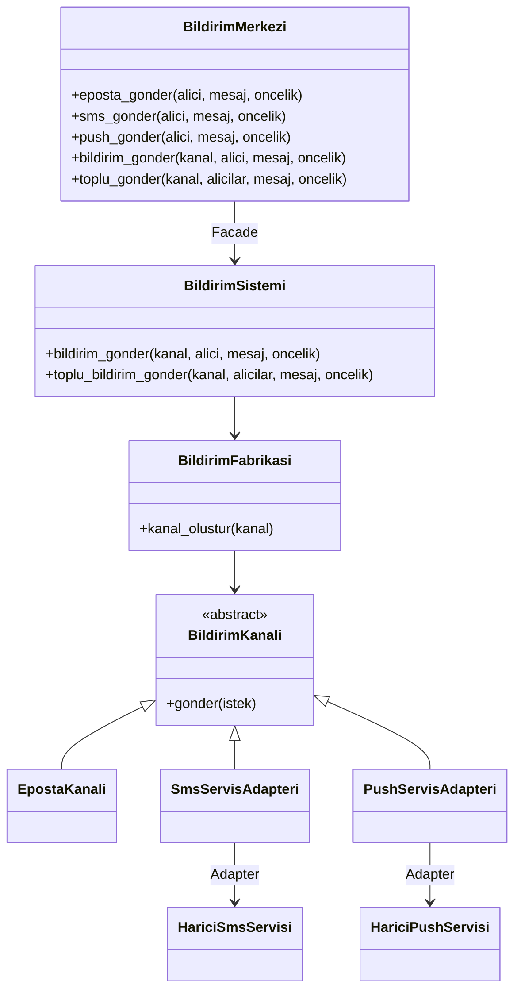
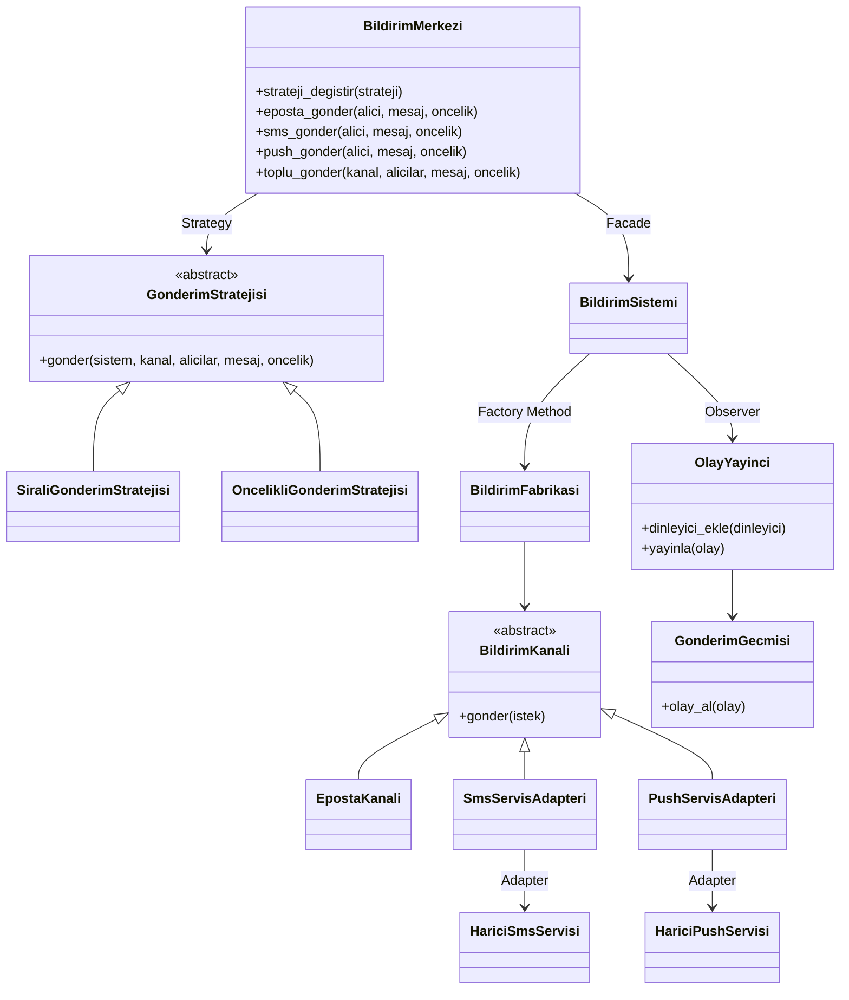

# Faz 3 Final Mimari Diyagrami

## Once

Faz 2 sonunda Adapter ve Facade eklenmisti. Ancak gonderim sonrasi tepkiler ve farkli gonderim politikalari henuz ayri davranissal oruntulerle genisletilebilir hale getirilmemisti.

## Sonra

Final yapida kullanici `BildirimMerkezi` ile calisir. Merkez, gonderim stratejisini kullanir; sistem kanal nesnesini fabrikadan alir; adapterler dis servisleri uyumlar; Observer yapisi gonderim olaylarini dinleyicilere bildirir.
